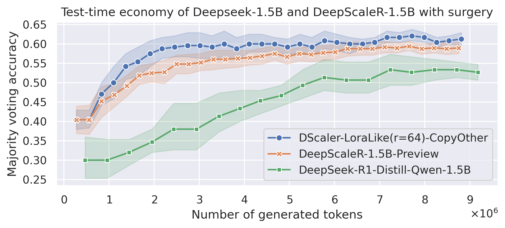

*This blog post was originally published on [Notion](https://shine-violet-b37.notion.site/Does-reasoning-exists-in-low-rank-Part-1-exploratory-analysis-19d105a2faeb801785bcddc5778a5d81?pvs=74).

> **TL;DR:** *I analyzed the difference between the weights of `DeepScaleR-1.5B-Preview` and its base model `DeepSeek-R1-Distill-Qwen-1.5B`. Turns out that the GRPO training process of DeepScaleR introduced only low-rank changes to its base model. Furthermore, by turning the weight difference to a LoRA-like adapter with \( r=64 \) and adding it to the DeepSeek base model, I observed **+2.3%** improvement on AIME 2024, consistent across runs.*

| model_name | Avg Maj@8 | Avg Maj@16 | Avg Maj@32 |
| --- | --- | --- | --- |
| **DScaler-LoraLike(r=64)-CopyOther** | **0.5875** | **0.6** | **0.6125** |
| DeepScaleR-1.5B-Preview | 0.527083 | 0.56875 | 0.589583 |
| DeepSeek-R1-Distill-Qwen-1.5B | 0.433333 | 0.526667 | 0.546667 |

## Introduction

The recent release of [DeepSeek-R1](https://arxiv.org/pdf/2501.12948) paper and the collection of [R1 distilled models](https://huggingface.co/collections/deepseek-ai/deepseek-r1-678e1e131c0169c0bc89728d) have inspired an avalanche of open-source attempts to replicate the success of RLVR (Reinforcement Learning from Verifiable Rewards) on reasoning tasks. Many Twitter users have reported their models reaching “aha moments” on GSM8K and other toy datasets. You can also experience the “aha moment” yourself using [Unsloth](https://docs.unsloth.ai/basics/reasoning-grpo-and-rl) or with [Open-R1](https://github.com/huggingface/open-r1)!

## Observations from open-source RL attempts

Among all the RLVR replication attempts on Twitter, a few things caught my eye:

- All of them reported reaching the “aha moment” with the Qwen family very quickly - one can get decent improvements in just a few hundred of steps on GSM8K ([@kalomaze](https://x.com/kalomaze/status/1890947610938073452), [@nrehiew_](https://x.com/nrehiew_/status/1887874867225063543), [@abacaj](https://x.com/abacaj/status/1885517088304857197)), “it literally just works”. For Llama 2, the training took much longer ([@rdolmedo_](https://x.com/rdolmedo_/status/1886505669622149139)).
- [@winglian](https://x.com/winglian/status/1888951180606202028) compared FFT, LoRA, and DoRA on GSM8K with GRPO and found that DoRA was able to converge much faster (in just 1/30th of the steps needed in FFT), with the drawback of being more unstable towards the end of training. Notably, LoRA was also much faster than FFT, just a bit behind DoRA.
- Recently, [@KyleLiang5](https://x.com/KyleLiang5/status/1891533772564164886) with Qwen-0.5B on GSM8K suggested that the KL penalty might be redundant and just clipping is enough. Perhaps it is connected to the fact that KL in GRPO is applied directly to the loss instead of adding to the reward? (more in [@alexanderklew](https://x.com/alexanderklew/status/1888805991149629862)’s thread)
- [DeepScaleR-1.5B-Preview](https://www.notion.so/19681902c1468005bed8ca303013a4e2?pvs=21), the first and, at the time of this report, only successful open-source attempt on performing RL with long generation, showed that a mere 1750 gradient update steps with small LR is enough to achieve [more than +10% on AIME’24 and AIME’25](https://github.com/agentica-project/deepscaler/issues/3) by my own evals.

All these 3rd party observations hints to the fact that we don’t need to change the base model by much to enhance its reasoning ability (or, rather, the ability to chain bits of knowledge together and reason for longer).

## Main Hypothesis

From the observations above, I formulated the following (totally non-rigorous) hypothesis:

> *The ability to connect pre-existing “chunks of knowledge” within the model to generate longer chain of reasoning exists in low-rank space.*

I want to note that the DoRA/LoRA experiments by [@winglian](https://x.com/winglian/status/1888951180606202028) above does not prove this hypothesis. For one, GSM8K is a very easy dataset and does not require long CoT generation. Secondly, to fully examine this hypothesis, we need to prove that FFT with RLVR will enhance a low-rank direction.

To provide more evidence for this hypothesis, I will verify the following:

- FFT with RLVR on hard olympiad problems with long reasoning traces will yield low-rank changes to the base model. Moreover, if we trim away all other dimensions of the changes, the accuracy on hard olympiad benchmarks should stay the same.
- PEFT methods like LoRA and DoRA with RLVR on hard olympiad problems with long reasoning traces will converge to the same accuracy

## Examining DeepScaleR, the frontier of RLVR

To check if FFT with GRPO or other RLVR methods on reasoning tasks yields low-rank changes to the base model, we need a strong model - one that is trained on hard olympiad problems and not saturated GSM8K or MATH500, and one that shows clear improvements on AIME’24 and AIME’25. Just a week ago, an ideal candidate appeared: [DeepScaleR-1.5B-Preview](https://www.notion.so/19681902c1468005bed8ca303013a4e2?pvs=21)!

DeepScaleR is the first successful open-source attempt to RLVR on long generations (up to 24K tokens per problem). Every kid and their mom can GRPO these days thanks to libraries like [Unsloth](https://unsloth.ai/blog/r1-reasoning) or [TRL](https://huggingface.co/docs/trl/en/index) and show gains on GSM8K/MATH with generation length of less than 1K tokens. Doing RLVR with reasoning traces of 24K tokens is a beast on another league!

### Singular Value Decomposition of Weights Differences

Let’s take a look at 3 models that are direct descendants of each other:

- [**Qwen2.5-Math-1.5B**](https://huggingface.co/Qwen/Qwen2.5-Math-1.5B), trained on a bunch of math reasoning traces, including hard olympiad-level math problems. This is the base model, the “grandpa” of our trio.
- [**DeepSeek-R1-Distill-Qwen-1.5B**](https://huggingface.co/deepseek-ai/DeepSeek-R1-Distill-Qwen-1.5B), uses Qwen2.5-Math-1.5B as the base model. It was distilled from the reasoning traces of Deepseek-R1 (i.e. trained with usual SFT) and shows remarkable results on various hard math benchmarks.
- [**DeepScaleR-1.5B-Preview**](https://huggingface.co/agentica-org/DeepScaleR-1.5B-Preview), uses DeepSeek-R1-Distill-Qwen-1.5B as the base model. It was trained by applying GRPO for 1750K gradient update steps on 40K olympiad-level math problems and a curriculum with gradually relaxed token budget enforcement.

By analyzing these 3 models, we can (hopefully) get a glimpse of the weight change dynamics of SFT and RLVR.

Let \( \mathcal{L} \) be the set of parameters of the Qwen2.5-1.5B architecture. Let \( \{ \mathcal{W}^B_l \}_{l \in \mathcal{L}} \) and \( \{ \mathcal{W}^D_l \}_{l \in \mathcal{L}} \) be the set of weights of the base and derivative model. We calculate the weight differences \( \{ \mathcal{D}_l = \mathcal{W}^D_l - \mathcal{W}^B_l \}_{l \in \mathcal{L}} \) and perform SVD on them, decomposing each \( \mathcal{D}_l \) into the product \( U_l \Sigma_l V_l \), where \( U_l \) and \( V_l \) are rotation matrices, and \( \Sigma_l \) is a diagonal matrix, the values on the main diagonal of which is called Singular Values. Intuitively, these singular values shows the “magnitude” of the changes in orthogonalized directions. Needless to say we perform SVD only on 2-dimensional tensors, which means only to the weights of `q_proj`, `k_proj`, `v_proj`, `o_proj`, `gate_proj`, `up_proj`, and `down_proj` layers.

Let’s take a look at the SVD of difference between DeepSeek-Distill (as derivative model) and Qwen2.5 (as base model) first:

Singular values of the weight differences between derivative model DeepSeek-R1-Distill-Qwen-1.5B and the base model Qwen2.5-Math-1.5B.

We can see that per-layer SVD drops very gradually, with bottom half of the SVs having ~40% of the magnitude of top SVs, which hints that most of the dimensions of the difference matrix are important. The max SV in each layer have quite large singular value as well (up to 5.0 in magnitude), suggesting drastic changes to the base model after SFT-ing on R1 reasoning traces.

Performing the same analysis on DeepScaleR as the derivative model and DeepSeek-Distill as the base model shows a totally different picture:

Singular values of the weight differences between derivative model DeepScaleR-1.5B-Preview and the base model DeepSeek-R1-Distill-Qwen-1.5B.

The singular values have much smaller magnitude compared to DeepSeek-Distill and Qwen2.5 (0.12 vs 5), and the normalized singular values chart on the left shows that only a few dimensions of the weight diffs have significant changes.

Can the dimensions with lower SVs be explained by noise during GRPO process? Can we just cut those low-magnitude dimensions away?

### Converting DeepScaleR into a “LoRA-like” model

Having the differences \( \{ \mathcal{D}_l = \mathcal{W}^D_l - \mathcal{W}^B_l \}_{l \in \mathcal{L}} \) between the “base” and “derivative’ models (in this case, DeepSeek-Distill and DeepScaleR), we can convert the differences into “LoRA-like” adapters and apply them to the base model.

More specifically, we compute \( \Sigma_l^{\text{LoRA}} \) by assigning all singular values of \( \Sigma_l \) except for top \( r \) ones to zero, then we compute \( \mathcal{D}^{\text{LoRA}}_l = U_l \Sigma^{\text{LoRA}}_l V_l \) and add that on top of the base model to get the weights of “LoRA-like” model \( \mathcal{W}_l^\text{LoRA} = \mathcal{W}_l^B + \mathcal{D}_l^\text{LoRA} \). This is equivalent to LoRA adapters with down-projection \( A = U_l \sqrt{\Sigma^{\text{LoRA}}_l} \) and up-projection \( B = \sqrt{\Sigma^{\text{LoRA}}_l} V_l \). Again, this is only applied to the weights of `q_proj`, `k_proj`, `v_proj`, `o_proj`, `gate_proj`, `up_proj`, and `down_proj` layers. For bias terms, we just copy them directly from DeepScaleR to DeepSeek-Distill.

Additionally, we should also decide what to do with `lm_head`, `token_embed`, `layernorm`, and final `rmsnorm` layers. Their magnitudes did not change significantly during the training process, which hints that the changes to them are not necessary. We will test 2 cases: leave them in the base model DeepSeek-Distill, or copy them over from DeepScaleR. To summarize, here is the list of models I prepared for testing (all of them uses DeepSeek-Distill as base model):

| Model name | “LoRA” rank | Source of `lm_head`, `token_embed`, `norm`, etc. |
| --- | --- | --- |
| DScaler-LoraLike(r=16)-CopyOther | 16 | Copied from DeepScaleR-1.5B-Preview |
| DScaler-LoraLike(r=64)-CopyOther | 64 | Copied from DeepScaleR-1.5B-Preview |
| DScaler-LoraLike(r=256)-CopyOther | 256 | Copied from DeepScaleR-1.5B-Preview |
| DScaler-LoraLike(r=16) | 16 | Left untouched in DeepSeek-R1-Distill-1.5B |
| DScaler-LoraLike(r=16) | 64 | Left untouched in DeepSeek-R1-Distill-1.5B |
| DScaler-LoraLike(r=16) | 256 | Left untouched in DeepSeek-R1-Distill-1.5B |

### Results on AIME 2024

First, let’s compare the 4 models: Lora-like with `lm_head`, `token_embed`, and `norm` layers copied from DeepScaleR, Lora-like with all other weights left as-is in the base DeepSeek-Distill model, and the DeepScaleR and DeepSeek models for reference. All charts and measurements below are performed as described in [this Github topic](https://github.com/agentica-project/deepscaler/issues/3). Let’s examine the effect of zeroing out SVs in the decomposition of weight diffs.

| model_name | Avg Maj@8 | Avg Maj@16 | Avg Maj@32 |
| --- | --- | --- | --- |
| **DScaler-LoraLike(r=64)-CopyOther** | **0.5875** | **0.6** | **0.6125** |
| DScaler-LoraLike(r=64) | 0.520833 | 0.55 | 0.566667 |
| DeepScaleR-1.5B-Preview | 0.527083 | 0.56875 | 0.589583 |
| DeepSeek-R1-Distill-Qwen-1.5B | 0.433333 | 0.526667 | 0.546667 |

The results suggests that throwing away a bunch of dimensions with small SV magnitude doesn’t hurt performance! In case of \( r=64 \) and `lm_head`, `token_embed`, and `norm` layers copied from DeepScaleR, the average Maj@32 metrics reached whopping `61.25%`, surpassing the full DeepScaleR model.

Another surprising point is that, when we just apply Lora-like weight changes to the base Deepseek-Distill model without changing the `lm_head`, `token_embed`, and `norm` of the base model, the performance doesn’t drop significantly. In fact, we are still within the noise range from the full results of FFT model DeepScaleR-1.5B-Preview.

I want to point out here that the confidence boundaries above were calculated by randomizing runs from a pool of reasoning traces, which means the gains of LoRA-like model here is consistent accross multiple runs with 32 attempts per problem!

Let’s take a closer look at the performance w.r.t. to the value or \( r \) (in case we copy other layers):

| model_name | Avg Maj@8 | Avg Maj@16 | Avg Maj@32 |
| --- | --- | --- | --- |
| **DScaler-LoraLike(r=64)-CopyOther** | **0.5875** | **0.6** | **0.6125** |
| DScaler-LoraLike(r=16)-CopyOther | 0.516667 | 0.554167 | 0.55 |
| DScaler-LoraLike(r=256)-CopyOther | 0.5375 | 0.579167 | 0.5875 |
| DeepScaleR-1.5B-Preview | 0.527083 | 0.56875 | 0.589583 |
| DeepSeek-R1-Distill-Qwen-1.5B | 0.433333 | 0.526667 | 0.546667 |

Here, we see that \( r=64 \) seems to be the sweet point: take less dimensions and you will loose some of the reasoning abilities. Take more and you will trace the full DeepScaleR model almost exactly. Let’s take a look at the other set of models, where the other layers (`lm_head`, `token_embed`, and `norm`) are kept as-is in the base model DeepSeek-R1-Distill:

| model_name | Avg Maj@8 | Avg Maj@16 | Avg Maj@32 |
| --- | --- | --- | --- |
| DScaler-LoraLike(r=64) | 0.520833 | 0.55 | 0.566667 |
| DScaler-LoraLike(r=16) | 0.529167 | 0.5625 | 0.566667 |
| DScaler-LoraLike(r=256) | **0.541667** | **0.570833** | 0.566667 |
| DeepScaleR-1.5B-Preview | 0.527083 | 0.56875 | **0.589583** |
| DeepSeek-R1-Distill-Qwen-1.5B | 0.433333 | 0.526667 | 0.546667 |

We see a consistent slight drop of performance, but that is expected - since token embeddings, lm head, and normalization values are all a bit off.

## Does that mean reasoning is low-rank?

While the the difference between FFT weights and base model resembles LoRA (i.e. only a handful of dimensions contributes to the overall performance gain), we still should consider if there are any factors of the training procedure that incentivies this behavior.

- The KL penalty of GRPO might be one of the factors that lead to LoRA-like behavior. Instead of adding it to the reward term, GRPO injects it directly into the loss term ([@alexanderklew](https://x.com/alexanderklew/status/1888805991149629862) wrote an excellent thread on Twitter about this). Basically, the usual KL penalty says: try not to wander outside the realm of sensible generations [as judged by our pretrained model], while GRPO’s penalty says: try not to lose any of the behaviors present in the pretrained model. This can lead to the training process being more frugal in presenting changes to more dimensions.
- This is only the behavior of the first few thousands of RL steps. Naturally, at the beginning of training, the process will explore the most fruitful directions first. Perhaps, if we leave the model to train for longer with RL, we will observe the SV distribution closer to the difference between DeepSeek-Distill and Qwen2.5 models.

Regardless of the reason, the practical implication here is clear:

> FFT with GRPO on a few thousand steps results in low-rank changes, hinting at the possibility of using PEFT instead.

